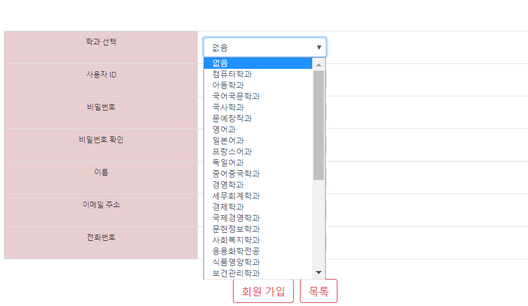

# :cherry_blossom:동덕여자대학교 DBP 팀프로젝트 

- 프로젝트명 : **동**덕여대 **신**입생 **메**신저연결 (**동신메**)
  
  - 신입생들의 원활한 학교 적응을 위한 신입생 맞춤 커뮤니티입니다.

 

 

## 1. 사용기술

MVC 구조를 기반으로 JSP를 이용해 개발했습니다.

- 언어 : JSP, Javascript, JSON, HTML5, CSS, Bootstrap
- 개발 환경 : Eclipse, oracle/SQL developer, Tomcat, ERwin

 

## 2. 담당 업무

- 각각 직접 mvc  모든 과정을 개발
- 이동선 
  1. Club  (동아리)
  2. Customer (회원)
  3. list, detail 디자인 템플릿

 

## 3. 비즈니스 로직

 

 

## 4. DB 스키마

 

 

## 5. 주요 기능

### 1) 메신저 연결
### 2) 동아리 매칭
### 3) 소모임
### 4) 학과별 공지사항

 

 

## 6. 스크린샷
### 로그인화면

 

### 회원가입

 

#### 1) 학과동아리 추천

 

#### 2) 중앙동아리 3개 랜덤 추천

 

### 회원list

 

### 회원detail

 

### 회원 수정

